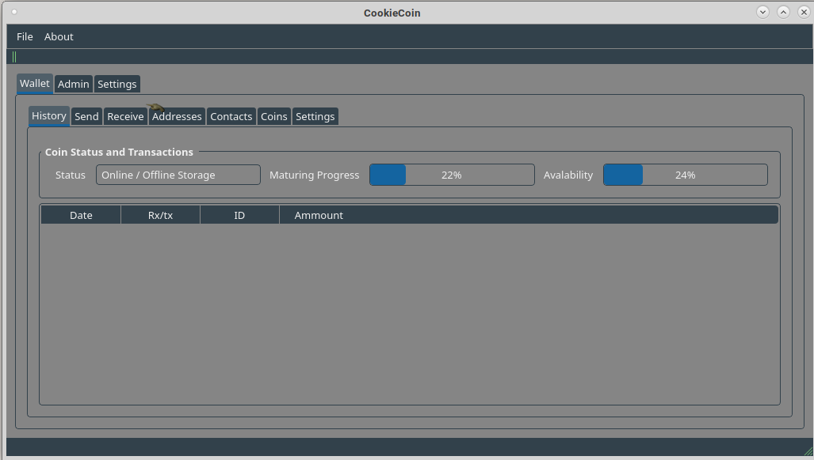
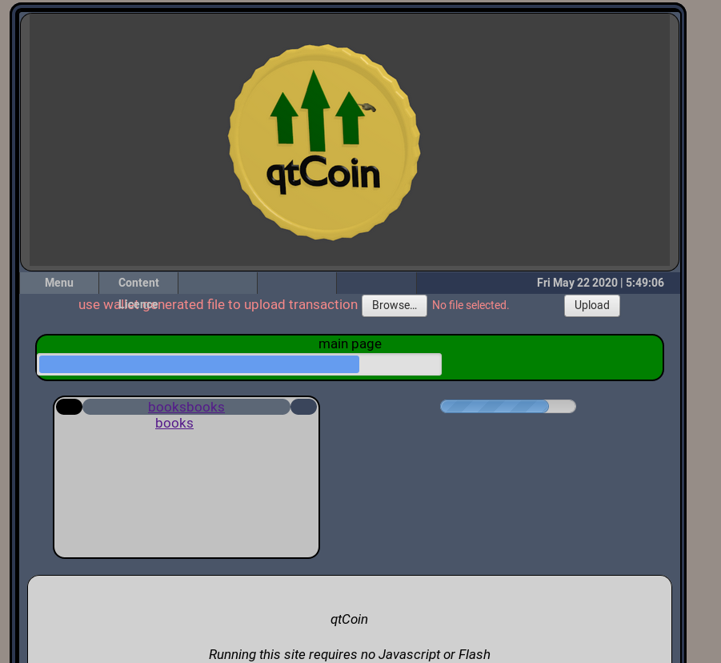
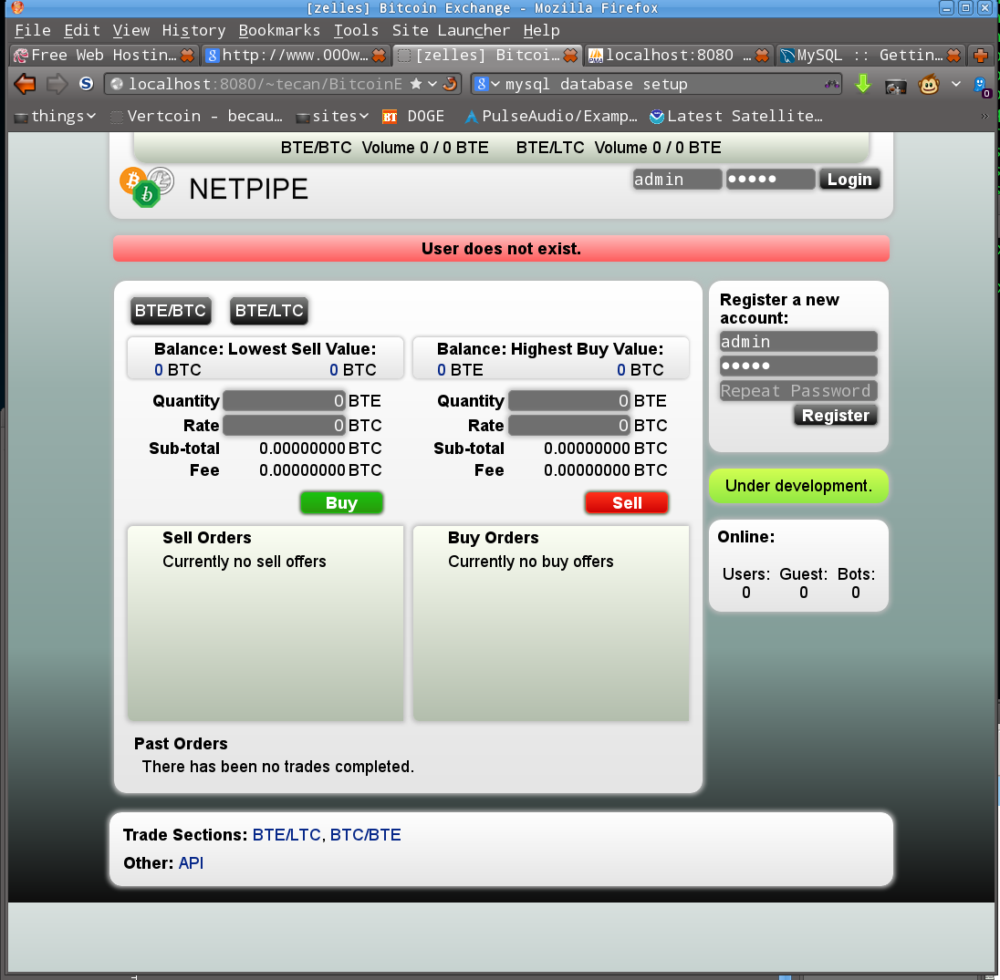
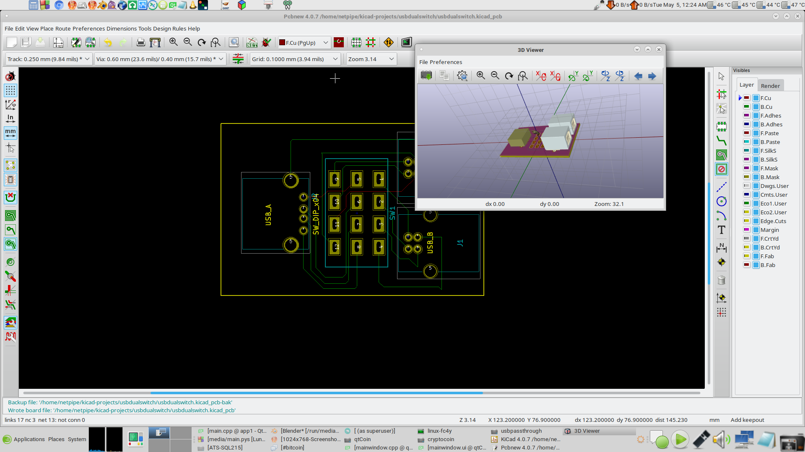

# EcoCoin
eco friendly cryptocoin

CryptoCoin that is completely remade, currently it will only be user to user and centralized.

status 70% done.

test exchange, the simple

usb mechanical switch example

Digital currency for low energy low impact

perfect for writing iou’s, having personal stock or coins

100 million – 3 billion coins in a database with generated wallet addresses probably around 20mb compressed ?

store a weeks worth of txs in blocks that can be updated like a repository (git or svn) if its older just redownload compressed ledger

divide the databases into 50 to make it easier on searching for coin addresses and r/w to harddrive.

decentralized or centralized

use md5sums on databases as part of the verify method, could check 20 or over 50 sources to verify tx if distributed

md5sum database use sum and public key xord to sign tx then use nodes to verify and distribute the tx

md5sum weekly db with previous hour/days block, coins can only be spent once per day or hour

all the processing nodes should have the same checksums after they write the tx blocks themselfs if tx’ the sums dont match then you need to download the hourly block from somewhere else

ideally you would only need about 20 to 50 processing nodes but the more the marrier

the previous hours block, it takes an hour to process tx’s unless you wanted minutely blocks
the tx’s in the block are timestamped so it would know to either check main db or one of the weekly blocks
probably something like coinaddress+publickey(walletaddress)+timestamp UTC

double spending would not be an issue because it takes an hour to process and verify

trusted nodes or central server option for fallback if internet crapsout

tx fee’s could be implimented and collected by the owner of the coin to prevent hft bot trading

 

Goal Coin

could be a way to double the investment price by acheving the goal of the coin, when goal is reached it will purchase back all the coins. secure stocks.
