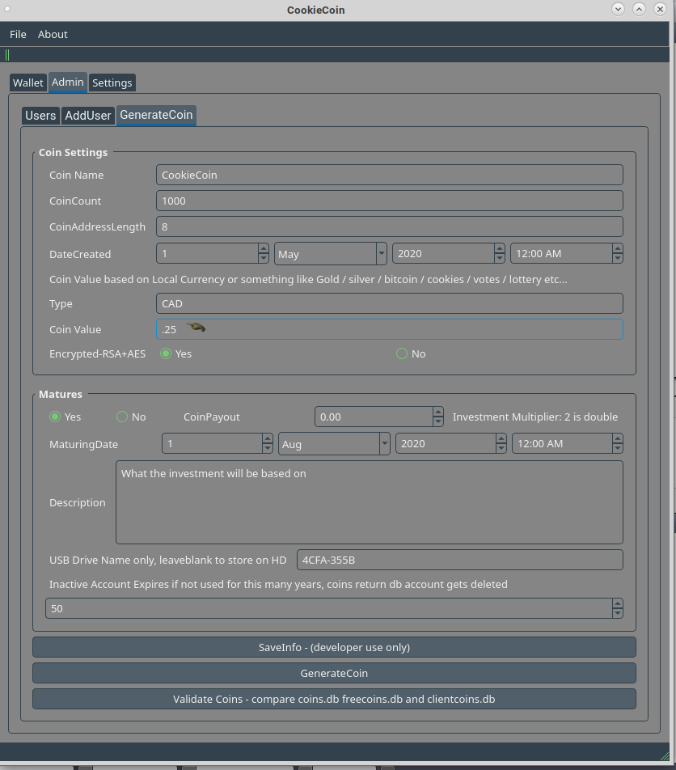

GPL project

CryptoCoin that is completely remade, currently it will only be user to user and centralized.

status 70% done.

usb mechanical switch example

code tricks
use projects->run->run in terminal option to see debug output

uses
majority share lottery or random pick
goal directed coin for production also buyback of products produced could extend time for payouts
voting system

coinexample names
food coin - sell food, buy 1 get one free when the investment matures
house coin - build houses based on selling them buy one get one free after they initial houses sell
123stockcoin

